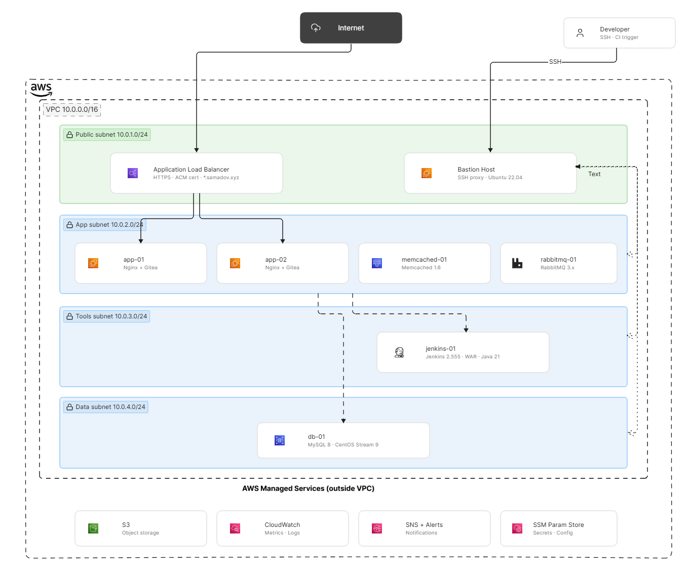
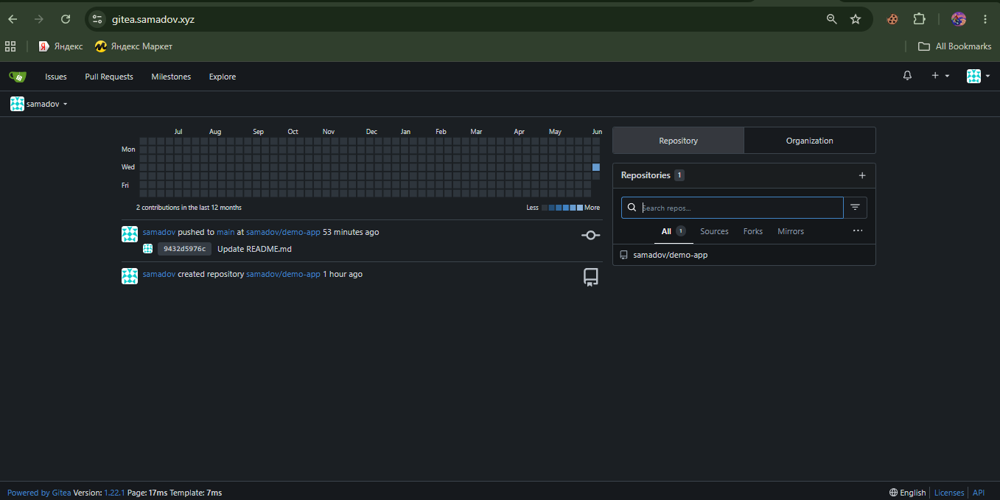
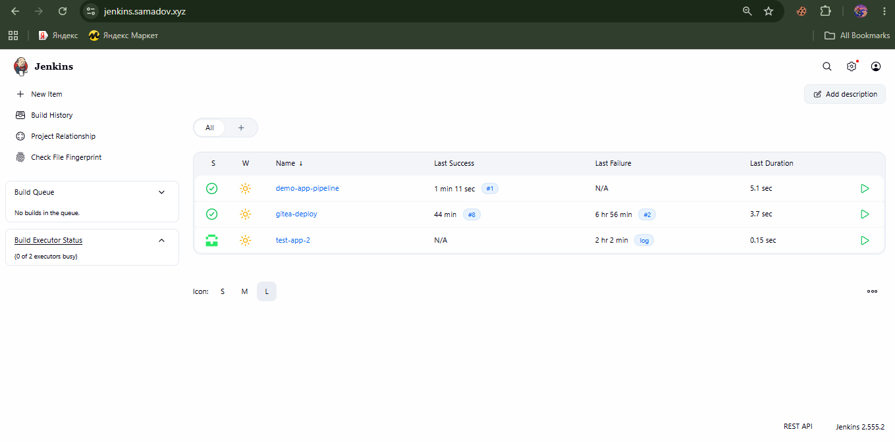
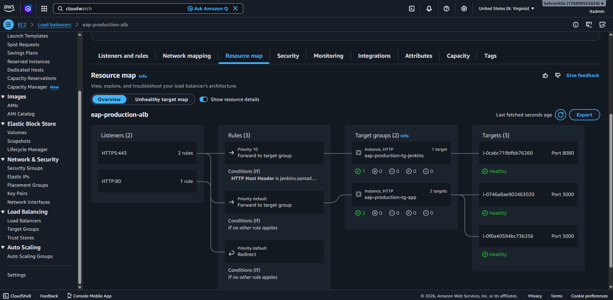
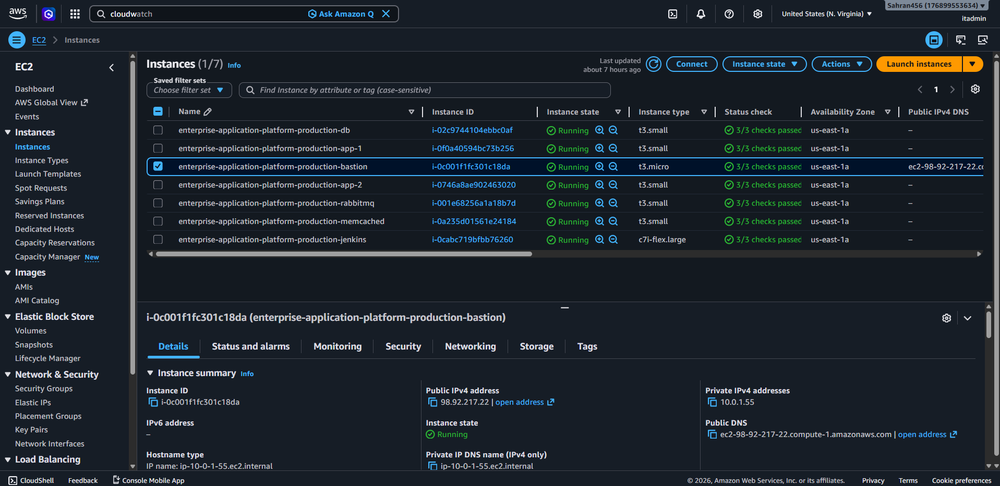

# Enterprise Application Platform

**Production-grade 3-tier infrastructure on AWS** — provisioned with Terraform, configured with Ansible, deployed via Jenkins CI/CD. Built to demonstrate end-to-end DevOps engineering: infrastructure as code, configuration management, automated deployments, monitoring, and security hardening.

> Infrastructure is destroyed when not in use to minimize AWS costs. Full environment redeploys from scratch in under 25 minutes.

---

## Live Demo

| Service | URL | Status |
|---------|-----|--------|
| Gitea (self-hosted Git) | https://gitea.samadov.xyz | Active when deployed |
| Jenkins CI/CD | https://jenkins.samadov.xyz | Active when deployed |

---

## Architecture Overview

```

```

### Network Layout

| Subnet | CIDR | Contains |
|--------|------|----------|
| Public | 10.0.1.0/24 | ALB, Bastion |
| App | 10.0.2.0/24 | App servers, RabbitMQ, Memcached |
| Tools | 10.0.3.0/24 | Jenkins |
| Data | 10.0.4.0/24 | MySQL |

---

## Tech Stack

| Category | Technology |
|----------|-----------|
| Cloud | AWS — VPC, EC2, ALB, ACM, Route 53, S3, CloudWatch, IAM, SSM |
| IaC | Terraform 1.x — 7 modules, 78 resources |
| Config Management | Ansible 2.17 — 9 roles, 6 servers |
| CI/CD | Jenkins 2.555 — Declarative pipeline, rolling deploy |
| Application | Gitea 1.22 — self-hosted Git |
| Database | MySQL 8 on CentOS Stream 9 |
| Message Queue | RabbitMQ 3.x |
| Cache | Memcached 1.6 |
| Web Server | Nginx (reverse proxy) |
| Monitoring | CloudWatch + SNS email alerts |
| Secrets | AWS SSM Parameter Store |
| OS | Ubuntu 22.04 LTS + CentOS Stream 9 |
| Domain | samadov.xyz via Route 53 |

---

## Project Structure

```
enterprise-application-platform/
├── Makefile                         # Shortcut commands (make tf-apply, make ansible-deploy)
├── terraform/
│   ├── environments/
│   │   └── production/              # Main entry point
│   │       ├── main.tf
│   │       ├── variables.tf
│   │       ├── outputs.tf
│   │       └── terraform.tfvars
│   └── modules/
│       ├── vpc/                     # VPC, subnets, NAT gateway, NACLs, flow logs
│       ├── compute/                 # EC2 instances — 6 servers
│       ├── security/                # Security groups — 7 groups
│       ├── alb/                     # ALB, listeners, target groups, Route 53 records
│       ├── iam/                     # IAM roles and instance profiles
│       ├── s3/                      # S3 bucket for backups and build artifacts
│       └── monitoring/              # CloudWatch alarms, SNS topic, Lambda notifier
├── ansible/
│   ├── site.yml                     # Master playbook — runs all roles
│   ├── ansible.cfg
│   ├── inventories/
│   │   └── production/
│   │       ├── hosts.yml            # Server inventory with Bastion proxy config
│   │       └── group_vars/
│   │           └── all.yml          # Variables — secrets pulled from SSM at runtime
│   └── roles/
│       ├── common/                  # Security hardening, UFW, fail2ban, MOTD
│       ├── nginx/                   # Reverse proxy — Gitea and Jenkins vhosts
│       ├── app/                     # Gitea binary, systemd service, app.ini config
│       ├── mysql/                   # MySQL 8 install, SELinux fix, DB/user creation
│       ├── rabbitmq/                # RabbitMQ + management plugin via Cloudsmith
│       ├── memcached/               # Memcached bound to private IP
│       ├── jenkins/                 # Jenkins WAR + Java 21 + systemd service
│       ├── monitoring/              # CloudWatch agent on all 6 servers
│       └── backup/                  # MySQL dump scripts + S3 upload cron jobs
└── jenkins/
    ├── Jenkinsfile                  # 12-stage declarative pipeline (rolling deploy)
    └── jobs/
        └── gitea-deploy.groovy      # Job DSL seed script
```

---

## Deployment

### Prerequisites
- AWS account with IAM permissions
- Terraform 1.x installed
- SSH key pair uploaded to AWS EC2
- Domain in Route 53

### Quick Start

```bash
# Clone
git clone https://github.com/Fedia-2211/enterprise-application-platform.git
cd enterprise-application-platform

# Store secrets in AWS SSM
make ssm-params

# Deploy infrastructure (~8 minutes, 78 resources)
make tf-init
make tf-apply

# Configure all 6 servers (~15 minutes)
# Update ansible/inventories/production/hosts.yml with new IPs first
make ansible-deploy

# Verify SSH connectivity
make verify-ssh
```

### Makefile Commands

```bash
make tf-init          # Terraform init (first time only)
make tf-plan          # Preview infrastructure changes
make tf-apply         # Create/update infrastructure
make tf-destroy       # Tear down everything

make ansible-deploy   # Configure all servers
make ansible-app      # Deploy Gitea only
make ansible-mysql    # Configure MySQL only
make ansible-jenkins  # Configure Jenkins only
make ansible-monitoring  # Deploy CloudWatch agents

make ssm-params       # Store secrets in AWS SSM
make verify-ssh       # Test SSH via Bastion to all servers
make export-ips       # Export Terraform outputs as env vars
```

### Post-Deploy (once per rebuild)

```bash
# Fix ALB health check path
aws elbv2 modify-target-group \
  --target-group-arn <ARN> \
  --health-check-path "/api/healthz"

# Update GoDaddy nameservers to match new Route 53 hosted zone NS records
# (Route 53 hosted zone is recreated on every terraform destroy/apply)
```

---

## Jenkins Pipeline

12-stage declarative pipeline with rolling deployment strategy:

```
Checkout → Validate → Download Artifact → Publish to S3
    → Pre-deploy Checks
    → Deploy: app-01 → Health Check: app-01
    → Deploy: app-02 → Health Check: app-02
    → Smoke Tests → Record Deployment
    (Rollback stage — triggered manually)
```

**Key features:**
- Rolling deploy — app-01 deployed and health-checked before touching app-02
- Automatic rollback — backup binary swapped back if health check fails after deploy
- Artifact checksums — SHA-256 verified before any server receives the binary
- S3 artifact store — every build uploaded with build metadata tags
- Deployment records — JSON manifest saved to S3 after every successful deploy
- Parameterised — version, target server, skip-tests, and rollback flags

---

## Security

- All servers private — only accessible via Bastion SSH proxy
- Security groups enforce least-privilege between every tier
- UFW firewall on all servers
- Fail2ban SSH brute-force protection
- HTTPS enforced via ACM wildcard certificate (`*.samadov.xyz`)
- Secrets stored in AWS SSM Parameter Store — never in code
- IAM roles with minimal required permissions per server role
- MySQL: SELinux enforced on CentOS, binary logging enabled, remote root disabled
- VPC Flow Logs → CloudWatch for network visibility

---

## Monitoring

CloudWatch alarms fire to SNS → email on:

| Alarm | Threshold |
|-------|-----------|
| CPU — all servers | > 80% |
| ALB 5xx error rate | > 10 errors |
| ALB response latency | > 2 seconds |
| Unhealthy ALB targets | > 0 |

---

## Key Engineering Decisions

**Gitea over GitHub** — self-hosted Git demonstrates operational depth: application deployment, database connectivity, reverse proxying, and health monitoring — skills that managed services abstract away.

**MySQL on CentOS Stream 9** — real environments use mixed OS stacks. CentOS-specific concerns (SELinux, firewalld, dnf) tested cross-platform Linux competency alongside Ubuntu.

**Ansible from Bastion** — Windows development environment; Ansible has no native Windows support. Running configuration management from the Bastion is the production-correct approach for air-gapped environments.

**Jenkins WAR over apt package** — the Jenkins apt GPG key had expired. The WAR-file approach is portable, version-pinned, and demonstrates understanding of the application beyond just installing a package.

---

## Real Production Issues Solved

Encountered and resolved during deployment — each added to the lessons-learned record:

| Issue | Root cause | Fix |
|-------|-----------|-----|
| ALB health checks failing | Default health path `/` returns 302 | Changed to `/api/healthz` |
| Gitea not binding to 0.0.0.0 | `HTTP_ADDR = 127.0.0.1` in app.ini | Set `HTTP_ADDR = 0.0.0.0` |
| Gitea hanging on start | Memcached unreachable across subnets | Switched cache adapter to `memory` |
| MySQL access denied | `!` in password causes bash history expansion | Used variable: `PASS='...'` then `-p"$PASS"` |
| SELinux blocking MySQL socket | CentOS SELinux context wrong after manual move | `restorecon -Rv /var/lib/mysql` |
| Jenkins fails to start | Latest WAR requires Java 21, had Java 17 | Installed `openjdk-21-jdk` |
| Jenkins GPG key failure | Expired apt key from old sources.list | Cleaned all stale sources, used WAR approach |
| Terraform state lock stuck | Previous apply interrupted mid-run | `terraform force-unlock <ID>` |
| Route 53 NS records change | Hosted zone recreated on every destroy | Update GoDaddy NS after each rebuild |
| ALB name too long | AWS 32-character limit | Renamed to `eap-production-alb` |
| Memcached not reachable | Bound to 127.0.0.1 by default | Template uses `ansible_default_ipv4.address` |
| Gitea config read-only | `ProtectSystem=full` in systemd unit | Set `ProtectSystem=false` in service file |

---

## Screenshots

### Gitea — Live at gitea.samadov.xyz


### Jenkins CI/CD — All Pipelines Green


### AWS ALB — All Targets Healthy (Jenkins + 2 App Servers)


### AWS EC2 — All 6 Servers Running


---

## Author

**Firdavs Samadov**
DevOps & Cloud Engineering Master's Student
2 years networking (Cisco CCNA 1–3) · 1 year Systems Administration

[GitHub](https://github.com/Fedia-2211) · [LinkedIn](#)